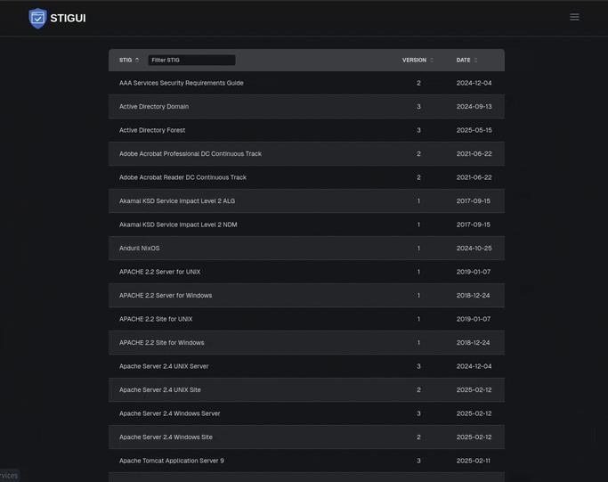

 

A simple web application for exploring and editing [DISA Security Technical Implementation Guides (STIGs)](https://public.cyber.mil/stigs/compilations/).



## Features

- **STIG:** Browse and search the full collection of DISA STIGs.
- **Export:** Download STIGs in CSV, JSON, and XML
- **Edit:** Modify STIGs similar to [STIG Viewer 3](https://www.cyber.mil/stigs/srg-stig-tools) with CKLB compatibility
  - All edits are stored in the browser using IndexDB, and there are no external network requests to any 3rd party tracker or analytics services.

## Getting Started

Access the application at [stigui.com](https://stigui.com).

## Local Development

To run STIGUI locally:

```bash
git clone <https://github.com/nealfennimore/stig.git>
cd stig
npm install
npm run dev
```

Your local instance should now be running at [http://localhost:3000](http://localhost:3000).

## Contributing

STIGUI is open-source, and contributions are welcome!

## License

This project is licensed under the MIT License - see the LICENSE file for details.
